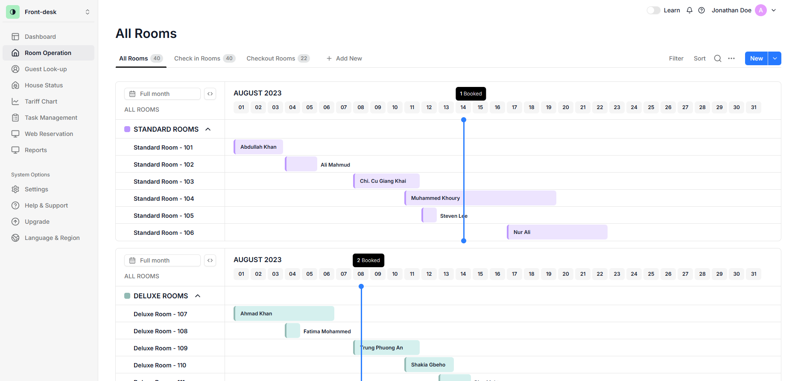

# Room Operation - Hotel Management



## Tecnologias

- [Next.js](https://nextjs.org)
- [Tailwind CSS](https://tailwindcss.com)
- [Shadcn UI](https://ui.shadcn.com/)
- [Motion](https://motion.dev/)


## Design

O design desta aplicação foi baseado em: [Room Operation - Hotel Management Web App V2](https://dribbble.com/shots/21355181-Room-Operation-Hotel-Management-Web-App-V2)

## Instalação

### 1. Clonar o repositório

```bash
git clone https://github.com/thiagop90/hotel-management.git
```

### 2. Instalar dependências

```bash
npm install
```

### 3. Execute o aplicativo

```bash
npm run dev
```

O aplicativo estará disponível em `http://localhost:3000`.